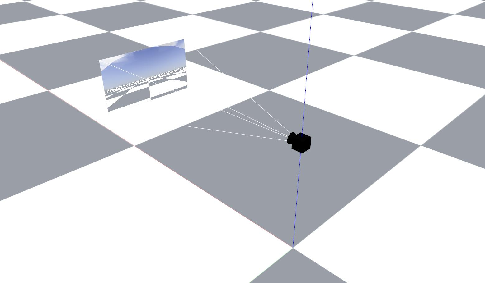

# generic_gazebo_camera_plugin

This is a very generic deployment of the gazebo camera plugin with some additional control on the camera params. 

<div align="center">
    
    
</div>

First set the params in the [parameters.yaml](params/parameters.yaml) file:

```YAML
color:
  fps: 30
  format: R8G8B8
  horizontal_fov: 1.3962634
  image_topic_name: rgb/image_raw
  camera_info_topic_name: rgb/camera_info
  image_width: 1280
  image_height: 720
```

To spawn the camera:
```bash
roslaunch generic_gazebo_camera_plugin spawn_camera.launch
```

| Argument | Default | Values | Description |
| ---| --- | --- | --- |
| `world_frame` | world |  |  |
| `camera_name` | camera |  |  |
| `camera_frame` | $(arg camera_name)_base_link |  |  |
| `x` | 0 | double (meters) |  |
| `y` | 0 | double (meters) |  |
| `z` | 0 | double (meters) |  |
| `roll` | 0 | double (rad) |  |
| `pitch` | 0 | double (rad) |  |
| `yaw` | 0 | double (rad) |  |
| `model_path` |  |  |  |
| `params_path` |  |  |  |